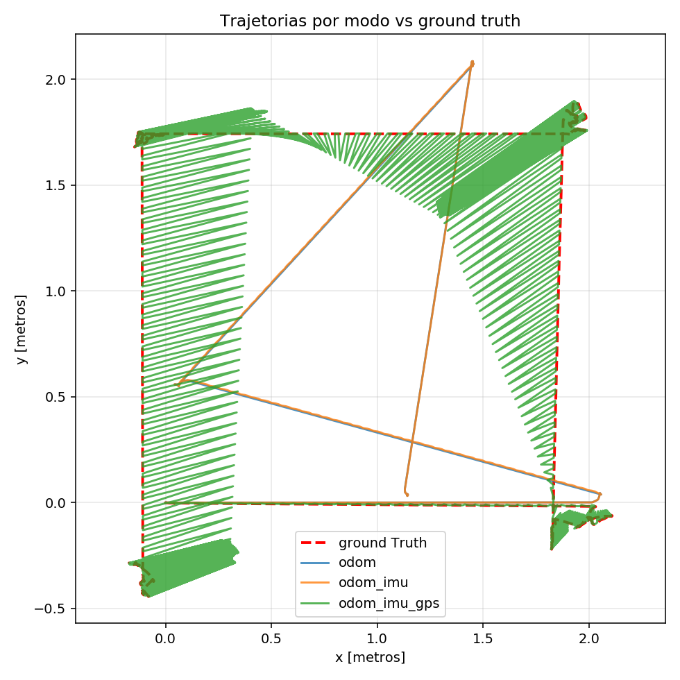
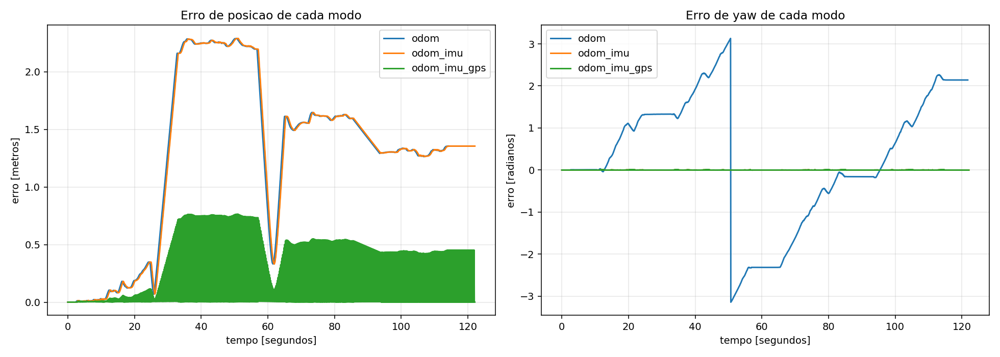
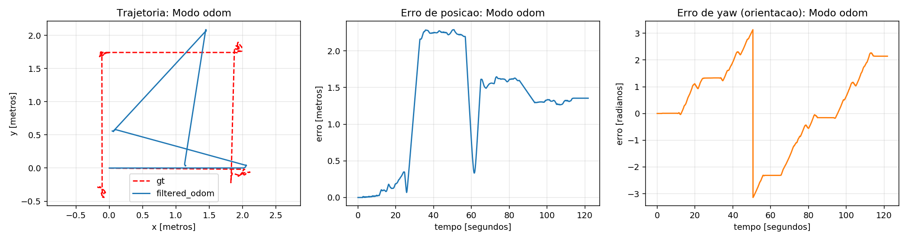
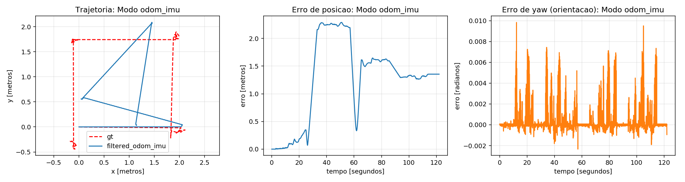
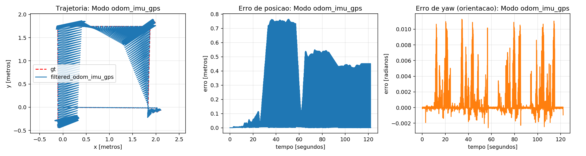

# Localização Husky — Fusão de Sensores com Filtro de Kalman Estendido no Robô Husky

Pacote ROS para comparação de três configurações de localização usando o **Filtro de Kalman Estendido (EKF)** no ambiente simulado do LaR/UFBA, com o robô **Clearpath Husky** no Gazebo.

---

## 📋 Descrição

Esta atividade avalia o impacto progressivo da fusão de sensores na qualidade da estimativa de pose do robô. Três configurações são comparadas em relação ao ground truth fornecido pelo simulador:

| Configuração | Sensores utilizados |
|---|---|
| **ODOM** | Odometria das rodas |
| **ODOM + IMU** | Odometria + IMU |
| **ODOM + IMU + GPS** | Odometria + IMU + GPS (convertido para x/y local) |

O GPS (latitude/longitude) é convertido para coordenadas locais x/y e publicado como `nav_msgs/Odometry` no tópico `/gps/odom`. 
O tópico `/gt/odom` é usado **exclusivamente como ground truth** — nunca como entrada do filtro.

---

## 📁 Estrutura do Pacote

```
localizacao_husky/
├── bags/                    # Bag ROS com os dados de sensores
├── config/                  # Arquivos .yaml de configuração do robot_localization
│   ├── ekf_config_odom.yaml
│   ├── ekf_config_odom_imu.yaml
│   └── ekf_config_odom_imu_gps.yaml
├── launch/                  # Launch files para cada configuração
│   ├── configs.launch
│   ├── main.launch
├── scripts/                 # Scripts Python de conversão, avaliação e plotagem
│   ├── gps_conversor.py       # Converte /navsat/fix → /gps/odom
│   ├── metricas.py          # Calcula métricas RMSE e erro final de cada modo
│   └── resultados.py      # Gera os gráficos
├── results/                 # Métricas e gráficos gerados automaticamente
├── images/                  # Gráficos de referência incluídos no README
│   ├── Trajetorias.png
│   ├── Comparacao_de_Erros.png
│   ├── odom_Trajetoria_e_erro.png
│   ├── odom_imu_Trajetoria_e_erro.png
│   └── odom_imu_gps_Trajetoria_e_erro.png
├── Fusion.sh                # Script principal que executa todos os testes
├── CMakeLists.txt
└── package.xml
```

---

## 🗂️ Tópicos ROS

### Entradas da bag

| Tópico | Tipo | Descrição |
|---|---|---|
| `/husky_velocity_controller/odom` | `nav_msgs/Odometry` | Odometria das rodas |
| `/imu/data` | `sensor_msgs/Imu` | Dados da IMU |
| `/navsat/fix` | `sensor_msgs/NavSatFix` | Posição GPS (lat/lon) |
| `/gazebo_ground_truth/odom` | `nav_msgs/Odometry` | Ground truth do simulador |

### Tópicos internos do pacote

| Tópico | Tipo | Descrição |
|---|---|---|
| `/wheel/odom` | `nav_msgs/Odometry` | Remapeamento da odometria |
| `/gps/odom` | `nav_msgs/Odometry` | GPS convertido para coordenadas locais |
| `/odometry/filtered` | `nav_msgs/Odometry` | Saída do EKF |
| `/gt/odom` | `nav_msgs/Odometry` | Ground truth (apenas avaliação) |

---

## 🐳 Configuração do Ambiente (Docker)

### 1. Carregar a imagem Docker

```bash
# A imagem base está no Dockerfile.noetic
docker build -f Dockerfile.noetic -t lar-gazebo:noetic .
```

### 2. Criar o container

```bash
docker run -it \
  --env DISPLAY=$DISPLAY \
  --env QT_X11_NO_MITSHM=1 \
  --volume /tmp/.X11-unix:/tmp/.X11-unix:rw \
  --volume ~/Projetos-Robotica/Localizacao-Husky:/workspace:rw \
  --network host \
  --name Fusao_Sensorial \
  lar-gazebo:noetic
```

### 3. Iniciar o container (sessões seguintes)

```bash
xhost +local:docker
docker start Fusao_Sensorial
docker exec -it Fusao_Sensorial bash
export LIBGL_ALWAYS_SOFTWARE=1
```

---

## Instalação do Pacote

Dentro do container, criar um link simbólico do volume montado para o workspace de compilação:

```bash
ln -s /workspace /ws/src/localizacao_husky
```

Compilar o pacote:

```bash
cd ~/ws
catkin build localizacao_husky
source devel/setup.bash
```

---

## Execução

O script `Fusion.sh` executa **automaticamente** as três configurações em sequência, processa a bag, calcula as métricas e gera os gráficos em `results/`:

```bash
/ws/src/localizacao_husky/Fusion.sh
```

O script realiza, para cada configuração:
1. Inicializa os nós ROS necessários (EKF, conversão GPS, avaliação)
2. Reproduz a bag com `rosbag play`
3. Coleta os dados de `/odometry/filtered` e `/gt/odom`
4. Calcula as métricas (RMSE, erro final de posição e orientação)
5. Salva os gráficos em `results/`

---

## 📊 Resultados

### Métricas de Comparação

| Configuração | Amostras | RMSE Pos (m) | Erro F. Pos (m) | RMSE Yaw (rad) | Erro F. Yaw (rad) |
|---|---:|---:|---:|---:|---:|
| ODOM | 1834 | 1.46484 | 1.35501 | 1.56103 | 2.14102 |
| ODOM + IMU | 1838 | 1.46301 | 1.35504 | 0.00155 | −0.00094 |
| ODOM + IMU + GPS | 1839 | 0.58601 | 0.00092 | 0.00247 | −0.00094 |

### Trajetórias Estimadas vs. Ground Truth



### Comparação Geral dos Erros



### ODOM — Trajetória e Erro



### ODOM + IMU — Trajetória e Erro



### ODOM + IMU + GPS — Trajetória e Erro



---

## Discussão dos Resultados

### ODOM (apenas odometria)

A odometria sozinha acumulou muitos erros ao longo do tempo, com RMSE de posição de **1.46 m** e um erro de orientação grande (**RMSE Yaw ≈ 1.56 rad ≈ 89°**), o que mostra o problema de *drift* da odometria de rodas, onde pequenos erros se acumularam e a falta de qualquer correção angular gerou uma trajetória estimada completamente divergente do trajeto real.

### ODOM + IMU

A adição da IMU não alterou muito o RMSE de posição (1.46 m), no entanto eliminou muito do erro de orientação, o RMSE Yaw caiu de **1.56 rad para 0.0015 rad**, uma redução de ~1000×, o que mostra que a IMU estabiliza a estimativa de direção, mesmo que sem informação posicional absoluta o drift acumulado nas coordenadas x/y continue.

### ODOM + IMU + GPS

A fusão com GPS foi a configuração com melhor desempenho geral. O RMSE de posição caiu para **0.586 m** e o erro final de posição convergiu para **0.92 mm**. Logo é visivél como a informação absoluta de posição do GPS corrige o drift acumulado muito bem, além disso a orientação permaneceu precisa por causa da IMU.

### Conclusão

Os resultados demonstraram os ganhos de cada sensor:
- **IMU** → corrige orientação, não posição
- **GPS** → corrige posição absoluta, elimina drift

A fusão `ODOM + IMU + GPS` via EKF é a abordagem mais indicada para localização confiável, reduzindo o erro de posição em ~60% e o erro final em ~99.9% em relação à odometria pura.

---

## Dependências

- ROS Noetic
- `robot_localization` (pacote EKF/UKF)
- `navsat_transform_node` (conversão GPS → odom)
- `rosbag`
- Python 3: `numpy`, `matplotlib`, `rospy`, `tf`

---

## 👩‍💻 Autora

**Ludmila** — Mestranda em Engenharia Elétrica e de Computação (PPGEEC/UFBA)  
Laboratório de Robótica (LaR/UFBA)
